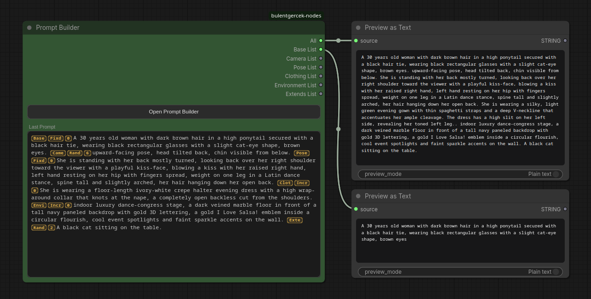
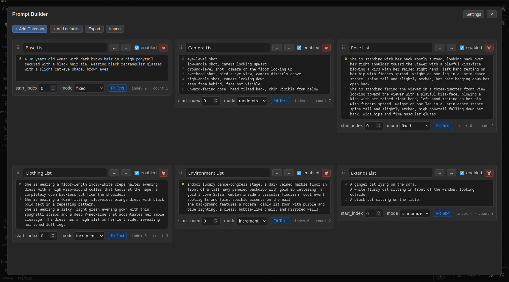
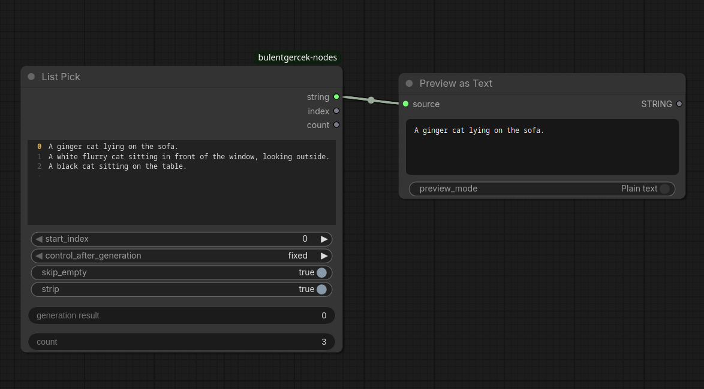
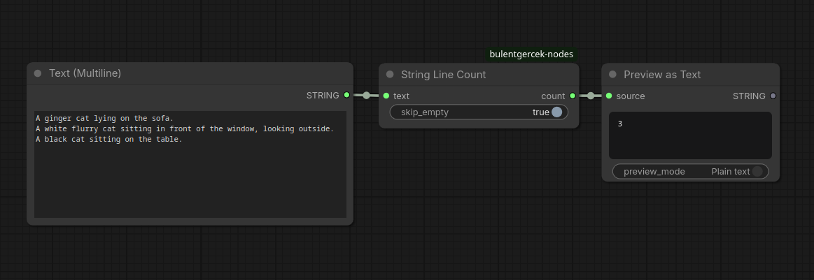

# bulentgercek-nodes

Custom nodes for ComfyUI. All nodes live under the `bulentgercek/text` category.

## Install

ComfyUI Manager, or clone into `ComfyUI/custom_nodes/`.

## Nodes

### Prompt Builder

Builds one prompt string from several named **categories**, each holding its own list of lines. The categories are not graph inputs — they are data stored inside the node and edited in a pop-up modal, so the node itself stays small no matter how many lists you keep.

Outputs:

- `all` (STRING): every enabled category's currently-picked line, joined with the delimiter. Always present.
- One STRING output per category, labelled with the category name (`Base List`, `Camera List`, …). The frontend adds and removes these slots as you add and remove categories, and existing wires follow a category when you rename or reorder it. Route e.g. the `Base List` output straight into a FaceDetailer while the rest go elsewhere.

Each category has:

- a **name** — only a label, not part of the output;
- a multiline **list**, one item per line (blank lines are skipped);
- a **mode** — `fixed` / `increment` / `decrement` / `randomize`, with the same walk semantics as [List Pick](#list-pick);
- a **start_index**;
- an **enabled** toggle — when off, the category drops out of `all`, but its own output still emits its pick.

The **Last Prompt** box on the node previews the joined result: before a run, what the next run will produce; after a run, what it actually produced. Each segment is prefixed with three small badges in the gutter colour — category (first 4 letters), mode (`Fixd` / `Incr` / `Decr` / `Rand`) and picked index. The copy button always copies the plain text, without badges.

#### The editor modal

`Open Prompt Builder` opens a full-screen modal with one card per category:

- Drag the `⠿` handle to reorder, or use the arrow buttons (they switch between ↑ ↓ and ← → depending on the column layout).
- Each card's text box has a line-number gutter, a per-card **Fit Text** toggle (auto-grow the box to fit its content) and an `index · count` readout.
- `+ Add Category` adds an empty one; `+ Add defaults` inserts the names from Settings.
- `Export` copies the whole set (categories + delimiter) as JSON, or downloads it as a file, to move it to another node. `Import` replaces this node's categories from that JSON.

**Settings** (top-right of the modal) are browser-wide, not per-workflow:

- `Default categories` — the comma-separated names `+ Add defaults` uses.
- `Delimiter` — the string joining the categories for this node (also the default for new nodes).
- `Window layout` — 1 / 2 / 3 / 4 fixed columns or auto-fill; all collapse to fewer columns as the window narrows.
- `UI Size` / `List Text Size` — scale the modal chrome and the category lists independently.
- `Compact Rows` — cap every card's text box height with an internal scrollbar, to keep the grid tidy.
- `Toggle Fit Text All` — turn auto-grow on for every category at once (and lock the per-card toggles while it is on).

#### State and reset

`increment` / `decrement` remember their position between runs, exactly like List Pick, but the state key is `unique_id + ":" + category_id`, so reordering categories never mixes up their counters. The state resets for a category when its `start_index` changes, its usable line count changes, or a new Queue action starts.

The category data lives in a hidden serialised `categories` widget, so it is saved and loaded with the workflow.

Server route: `POST /bulentgercek/prompt_builder/reset` — same contract as the List Pick route below.

### List Pick

Picks one line out of a multiline string list and returns it as a string, together with the index that was picked and the total line count.

Inputs:

- `string_list` (STRING, multiline): one item per line.
- `start_index` (INT): the starting point for picking. This is a starting point only, not a lower bound — `increment` and `decrement` are free to wrap around to any line in the list, including lines before `start_index`.
- `control_after_generation` (fixed / increment / decrement / randomize): how the index changes from one run to the next.
- `skip_empty` (BOOLEAN): if true, blank lines are removed before indexing and counting.
- `strip` (BOOLEAN): if true, leading/trailing whitespace is stripped from the returned string.

Outputs:

- `string`: the picked line.
- `index`: the index that was picked.
- `count`: the number of usable lines (after `skip_empty` is applied).

Mode behavior:

- `fixed`: always returns `start_index`. No internal state involved.
- `increment` / `decrement`: the first run after a reset (see below) returns `start_index`. Every following run in the same queue action moves by one step and wraps around the full list — passing the last line goes back to line 0, going below line 0 goes back to the last line. Example: 3 lines, `start_index = 2`, `increment`, four runs in a row → indices `2, 0, 1, 2`.
- `randomize`: returns a uniformly random index over the whole list on every run.

State and reset:

`increment` and `decrement` need to remember the last picked index between runs. This memory is kept server-side, per node, in a plain Python dict keyed by the node's id — ComfyUI does not give custom `control_after_generation` combos any built-in state of their own, unlike the native `seed` widget.

That memory is cleared, and the walk restarts from `start_index`, whenever any of the following happens:

- `start_index` is changed.
- The number of usable lines changes (editing the list, or toggling `skip_empty`).
- A new Queue action is started in the UI.

The last point is what keeps this predictable across separate uses: queuing once with a batch count of N walks N steps forward from `start_index` within that one action, but the next time you press Queue, the walk starts over from `start_index` again — it does not keep drifting forward across unrelated queue presses.

Companion frontend (`web/list_pick.js`) adds:

- Two read-only rows on the node, "generation result" and "count", showing the last picked index and the current line count.
- A line-number gutter next to the text box. Before anything has run (or right after a reset), it highlights the line that the next run will pick. After a run, it highlights the line that was actually picked.
- A hook on the Queue action and on the server's queue-empty event, so the gutter and the "generation result" row snap back to previewing `start_index` as soon as the queue is empty, instead of staying on whatever was last generated.

Server route: `POST /bulentgercek/list_pick/reset` — accepts `{"ids": [<node_id>, ...]}` and clears the stored state for those node ids (or all state if no ids are given). Called by the frontend hook above; not meant to be called by hand.

### String Line Count

Counts the lines in a string.

Inputs:

- `text` (STRING, forced input, multiline): the text to count lines in.
- `skip_empty` (BOOLEAN): if true, blank lines are not counted.

Outputs:

- `count` (INT): the number of lines.

## License

MIT — see [LICENSE](LICENSE).
